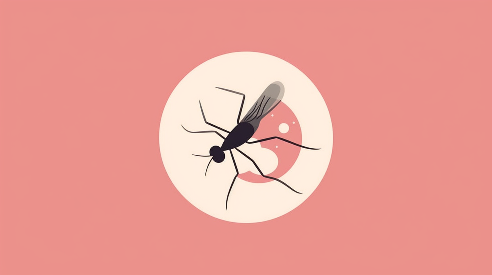

<!-- Improved compatibility of back to top link: See: https://github.com/nhlong27/dengueapp/pull/73 -->
<a id="readme-top"></a>

<!-- PROJECT SHIELDS -->
[![Contributors][contributors-shield]][contributors-url]
[![Forks][forks-shield]][forks-url]
[![Stargazers][stars-shield]][stars-url]
[![Issues][issues-shield]][issues-url]
[![MIT License][license-shield]][license-url]
[![LinkedIn][linkedin-shield]][linkedin-url]

<!-- PROJECT LOGO -->
<br />
<div align="center">
  <a href="https://dengue-defense.vercel.app/" target='_blank'>
    
  </a>

  <h3 align="center">Dengue Defense</h3>

  <p align="center">
    An application website for dengue combat, integrated with IoT devices
    <br />
    Version: v1.0.0-alpha
    <br />
    Author: Nguyen Hoang Long 
    <br />
    Email: nhlong2706@gmail.com 
    <br />
    <a href="https://dengue-defense.vercel.app/" target='_blank'>View Demo</a>
    ·
    <a href="https://github.com/nhlong27/dengue-defense/issues" target='_blank'>Report Bug</a>
    ·
    <a href="https://github.com/nhlong27/dengue-defense/pulls" target='_blank'>Request Feature</a>
  </p>
</div>

## Live Demo
Official website: <a href="https://dengue-defense.vercel.app/" target='_blank'>https://dengue-defense.vercel.app</a>

<!-- TABLE OF CONTENTS -->
<details>
  <summary>Table of Contents</summary>
  <ol>
    <li>
      <a href="#about">About The Project</a>
      <ul>
        <li><a href="#duration">Duration</a></li>
        <li><a href="#application-flow">Application flow</a></li>
        <li><a href="#technologies">Technologies</a></li>
      </ul>
    </li>
    <li>
      <a href="#getting_started">Getting Started</a>
    </li>
    <li><a href="#contributing">Contributing</a></li>
  </ol>
</details>


<!-- ABOUT THE PROJECT -->
<a id='about'></a>
## About the project

[![Product Preview][product-preview]](...url)
Originally an application integrated with IoT devices for awareness and preventive measures, this is the refactored version of my thesis project built on Nextjs. This project encompasses frontend and backend development, designing a user-friendly interface with data visualization components, establishing APIs for IoT device communication, and configuring a database to store and retrieve information.

This project has further deepened my understanding of pub/sub mechanisms and their contextual applications. The incorporation of polling mechanisms to interact with Kafka has granted me practical experience in data collection strategies. Simultaneously, the integration of a time series database for telemetry storage has honed my skills in data management.

My exploration of TRPC and type-safe APIs has also equipped me with a solid grasp of efficient communication protocols. I've also attempted session-based authentication, enhancing my knowledge of security measures.
 
 <!-- Finally, deploying the application to an EC2 instance has broadened my understanding of cloud infrastructure and deployment procedures. -->

<a id='duration'></a>
## Duration

June - July 2023 
## Application flow  
<!-- <b>Note</b>: media = movie | TV shows -->
<ul>
  <li>User signs up/ signs in with credentials / signs in with Google provider
  </li>
  <li>User browses available patients, doctors 
  </li>
  <li>User views past device logs
  <li>User as DOCTOR creates / removes devices or assigns to patients, 
  <li>User views device details: <i>telemetries</i>, <i>assigned user</i>, <i>logs</i>, etc.
  <li>User as DOCTOR starts devices to collect telemetry
</ul>

<a id='technologies'></a>
<h2>Technologies</h2>

<ul>
  <li>Client: Next/TS, Tailwind (shadcn, recharts), Jotai</li>
  <li>Server: Session-based Next-Auth, trpc (zod), prisma/PostgreSQL + timeseries, Kafka topics</li>
  <li>Deployment: Vercel, Supabase</li>
</ul>

<p align="right">(<a href="#readme-top">back to top</a>)</p>

<!-- GETTING STARTED -->
<a id='getting_started'></a>
## Getting Started

1. Clone the repo.
   ```sh
   git clone https://github.com/nhlong27/dengue-defense
   ```
2. Install NPM packages
   ```sh
   npm i
   ```
3. Add env variables
    ```js
    DATABASE_URL (postgresql)
    NEXTAUTH_SECRET 
    NEXTAUTH_URL
    NEXT_PUBLIC_URL
    GOOGLE_CLIENT_ID
    GOOGLE_CLIENT_SECRET
    KAFKA_BROKER_URL
    KAFKA_USERNAME
    KAFKA_PASSWORD
    ```

If you have any troubles please either create an issue or email me. Or message me here: (link to be added)
<p align="right">(<a href="#readme-top">back to top</a>)</p>


<!-- CONTRIBUTING -->
<a id='contributing'></a>
## Contributing

Contributions are what make the open source community such an amazing place to learn, inspire, and create. Any contributions you make are **greatly appreciated**.

If you have a suggestion that would make this better, please fork the repo and create a pull request. You can also simply open an issue with the tag "enhancement".
Don't forget to give the project a star! Thanks again!

1. Fork the Project
2. Create your Feature Branch (`git checkout -b feature/AmazingFeature`)
3. Commit your Changes (`git commit -m 'Add some AmazingFeature'`)
4. Push to the Branch (`git push origin feature/AmazingFeature`)
5. Open a Pull Request


See the [open issues](https://github.com/nhlong27/movieSite/issues) for a full list of proposed features (and known issues).


<p align="right">(<a href="#readme-top">back to top</a>)</p>


<!-- MARKDOWN LINKS & IMAGES -->

<!-- https://www.markdownguide.org/basic-syntax/#reference-style-links -->
[contributors-shield]: https://img.shields.io/github/contributors/nhlong27/movieSite.svg?style=for-the-badge
[contributors-url]: https://github.com/nhlong27/movieSite/graphs/contributors
[forks-shield]: https://img.shields.io/github/forks/nhlong27/movieSite.svg?style=for-the-badge
[forks-url]: https://github.com/nhlong27/movieSite/network/members
[stars-shield]: https://img.shields.io/github/stars/nhlong27/movieSite.svg?style=for-the-badge
[stars-url]: https://github.com/nhlong27/movieSite/stargazers
[issues-shield]: https://img.shields.io/github/issues/nhlong27/movieSite.svg?style=for-the-badge
[issues-url]: https://github.com/nhlong27/movieSite/issues
[license-shield]: https://img.shields.io/github/license/nhlong27/movieSite.svg?style=for-the-badge
[license-url]: https://github.com/nhlong27/movieSite/blob/master/LICENSE.txt
[linkedin-shield]: https://img.shields.io/badge/-LinkedIn-black.svg?style=for-the-badge&logo=linkedin&colorB=555
[linkedin-url]: https://www.linkedin.com/in/long-nguyen-95517b250/

<!-- Screenshots -->
[product-preview]: public/screenshots/product-preview.png

<!-- Frameworks/libraries -->
[React-badge]: https://img.shields.io/badge/React-20232A?style=for-the-badge&logo=react&logoColor=61DAFB
[React-url]: https://reactjs.org/
[Vite-badge]: https://img.shields.io/badge/vite-%23646CFF.svg?style=for-the-badge&logo=vite&logoColor=white
[Vite-url]: https://vitejs.dev/
[TailwindCSS-badge]: https://img.shields.io/badge/tailwindcss-%2338B2AC.svg?style=for-the-badge&logo=tailwind-css&logoColor=white
[TailwindCSS-url]: https://tailwindcss.com/
[Jotai-badge]: https://img.shields.io/badge/-Jotai-white?style=for-the-badge
[Jotai-url]: https://jotai.org/
[NodeJS-badge]: https://img.shields.io/badge/node.js-6DA55F?style=for-the-badge&logo=node.js&logoColor=white
[NodeJS-url]: https://nodejs.org/en/
[MongoDB-badge]: https://img.shields.io/badge/MongoDB-4EA94B?style=for-the-badge&logo=mongodb&logoColor=white
[MongoDB-url]: https://www.mongodb.com/
[ExpressJS-badge]: 	https://img.shields.io/badge/Express.js-404D59?style=for-the-badge
[ExpressJS-url]: https://expressjs.com/
[Zustand-badge]: https://img.shields.io/badge/-zustand-orange
[Zustand-url]: https://github.com/pmndrs/zustand
[Typescript-badge]: https://img.shields.io/badge/TypeScript-007ACC?style=for-the-badge&logo=typescript&logoColor=white
[Typescript-url]: https://www.typescriptlang.org/
[Zod-badge]: https://img.shields.io/badge/-zod-blue
[Zod-url]: https://zod.dev/